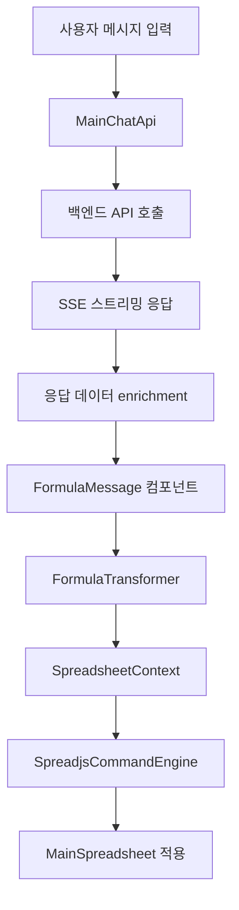

# Excel Formula 백엔드 응답 처리 및 MainSpreadsheet 적용 로직

## 개요
이 문서는 백엔드에서 `excel_formula` 형식의 응답이 왔을 때 MainSpreadsheet에 어떻게 적용되는지에 대한 전체적인 로직과 작동 방식을 상세히 설명합니다.

## 1. 전체 아키텍처 및 데이터 흐름



## 2. 백엔드 응답 형식

### 2.1 API 응답 구조 (NewChatResponseData)
```typescript
interface NewChatResponseData {
  success: boolean;
  tokensUsed: number;
  responseTime: number;
  model: string;
  cached: boolean;
  confidence: number;
  
  // Excel Formula 관련 데이터
  analysis?: {
    detectedOperation: string;
    dataRange?: string;
    targetCells?: string;
    operationType?: 'single_cell' | 'multiple_cells' | 'range_operation';
  };
  
  formulaDetails?: {
    name: string;
    description: string;
    syntax: string;
    parameters: Array<{
      name: string;
      description: string;
      required: boolean;
      example: string;
    }>;
    spreadjsCommand: string; // 핵심! SpreadJS 실행 명령어
  };
  
  implementation?: {
    steps: string[];
    cellLocations: {
      source: string;
      target: string;
      description: string;
    };
  };
}
```

### 2.2 백엔드 응답 예시
```json
{
  "success": true,
  "formulaDetails": {
    "name": "SUM",
    "description": "선택된 범위의 모든 숫자를 합계합니다",
    "syntax": "=SUM(범위)",
    "spreadjsCommand": "sheet.setFormula(0, 2, '=SUM(A1:B10)')",
    "parameters": [...]
  },
  "analysis": {
    "detectedOperation": "합계 계산",
    "dataRange": "A1:B10",
    "targetCells": "C1",
    "operationType": "range_operation"
  },
  "implementation": {
    "steps": ["범위 선택", "수식 적용"],
    "cellLocations": {
      "source": "A1:B10",
      "target": "C1",
      "description": "합계 결과를 C1에 표시"
    }
  }
}
```

## 3. 프론트엔드 처리 과정

### 3.1 MainChatApi에서의 응답 처리 (mainChatApi.ts)

#### SSE 스트리밍 및 Intent 감지
```typescript
// 1. SSE 이벤트 수신
case SSEEventType.CHAT_RESPONSE:
  this.updateStatus(ChatStatus.TYPING, handlers);
  await this.handleTypingEffect(data, handlers);
  break;

// 2. 응답 데이터 enrichment
private enrichResponseWithIntent(data: NewChatResponseData) {
  let intent: string | undefined;
  let structuredContent: any;

  if (data.formulaDetails) {
    intent = 'excel_formula';
    structuredContent = {
      intent: 'excel_formula',
      ...data.formulaDetails,
      analysis: data.analysis,
      implementation: data.implementation,
      originalData: data
    };
  }
  
  return {
    ...data,
    intent,
    structuredContent
  };
}
```

#### 주요 특징:
- **자동 Intent 감지**: `formulaDetails`가 있으면 자동으로 `excel_formula` intent로 분류
- **structuredContent 생성**: 기존 ChatResponseDto 형식과 호환성을 위해 구조화된 컨텐츠 생성
- **원본 데이터 보존**: `originalData` 필드에 전체 응답 데이터 저장

### 3.2 FormulaMessage 컴포넌트 (formulaMessage.tsx)

#### 수식 적용 버튼 및 자동 실행 로직
```typescript
export default function FormulaMessage({ message, className = "" }: FormulaMessageProps) {
  const [isApplied, setIsApplied] = useState(false);
  const [isExecuting, setIsExecuting] = useState(false);
  const [executionError, setExecutionError] = useState<string | null>(null);
  
  const spreadsheetContext = useSpreadsheetContextSafe();
  const { mode } = useChatModeStore();

  // 수식 적용 함수
  const handleApplyFormula = useCallback(async () => {
    if (!spreadsheetContext?.isReady) {
      setExecutionError('스프레드시트가 준비되지 않았습니다.');
      return;
    }
    
    if (!isValidFormulaContent(message.structuredContent)) {
      setExecutionError('유효하지 않은 수식 데이터입니다.');
      return;
    }
    
    setIsExecuting(true);
    setExecutionError(null);
    
    try {
      // structuredContent를 FormulaResponse로 변환
      const formulaResponse = transformStructuredContentToFormulaResponse(
        message.structuredContent
      );
      
      // 검증 및 실행
      if (!validateFormulaResponse(formulaResponse)) {
        throw new Error('변환된 수식 데이터가 유효하지 않습니다.');
      }
      
      await spreadsheetContext.executeFormula(formulaResponse);
      setIsApplied(true);
      
    } catch (error) {
      setExecutionError(error instanceof Error ? error.message : '수식 적용 중 오류가 발생했습니다.');
    } finally {
      setIsExecuting(false);
    }
  }, [spreadsheetContext, message.structuredContent]);

  // Agent 모드에서 자동 적용
  useEffect(() => {
    if (
      mode === 'agent' && 
      message.status === 'completed' && 
      !isApplied && 
      !isDenied && 
      !executionError && 
      !isExecuting &&
      spreadsheetContext?.isReady &&
      message?.structuredContent?.intent === "excel_formula"
    ) {
      handleApplyFormula();
    }
  }, [mode, message.status, isApplied, spreadsheetContext?.isReady, handleApplyFormula]);
  
  // UI 렌더링...
}
```

#### 주요 특징:
- **모드별 동작**: `edit` 모드에서는 사용자 승인 필요, `agent` 모드에서는 자동 실행
- **상태 관리**: 적용 상태, 실행 중 상태, 에러 상태 등 세밀한 상태 관리
- **안전한 Context 사용**: `useSpreadsheetContextSafe`로 스프레드시트 준비 상태 확인

### 3.3 FormulaTransformer (formulaTransformer.ts)

#### structuredContent → FormulaResponse 변환
```typescript
export function transformStructuredContentToFormulaResponse(
  structuredContent: StructuredFormulaContent
): FormulaResponse {
  const defaultResponse: FormulaResponse = {
    success: true,
    analysis: {
      detectedOperation: structuredContent.detectedOperation || 'Unknown operation',
      dataRange: structuredContent.sourceRange || 'A1:A1',
      targetCells: structuredContent.targetRange || 'B1',
      operationType: structuredContent.analysisType || 'formula'
    },
    formulaDetails: {
      name: structuredContent.formulaName || 'Custom Formula',
      description: structuredContent.formulaDescription || 'Formula execution',
      syntax: structuredContent.formulaSyntax || '',
      spreadjsCommand: structuredContent.spreadjsCommand || ''
    },
    implementation: {
      steps: structuredContent.implementation?.steps || ['Apply formula'],
      cellLocations: {
        source: structuredContent.implementation?.cellLocations?.source || 
                structuredContent.sourceRange || 'A1',
        target: structuredContent.implementation?.cellLocations?.target || 
                structuredContent.targetRange || 'B1',
        description: structuredContent.implementation?.cellLocations?.description || 
                    'Formula application'
      }
    }
  };

  // SpreadJS 명령어 생성 (없는 경우)
  if (!defaultResponse.formulaDetails.spreadjsCommand) {
    defaultResponse.formulaDetails.spreadjsCommand = generateDefaultSpreadJSCommand(
      structuredContent,
      defaultResponse
    );
  }

  return defaultResponse;
}

// 기본 SpreadJS 명령어 생성
function generateDefaultSpreadJSCommand(
  structuredContent: StructuredFormulaContent,
  response: FormulaResponse
): string {
  const targetCell = response.implementation.cellLocations.target;
  const formula = structuredContent.formulaSyntax || '';
  
  const cellMatch = targetCell.match(/([A-Z]+)(\d+)/);
  if (cellMatch && formula) {
    const [, col, row] = cellMatch;
    const colIndex = col.charCodeAt(0) - 65; // A=0, B=1, ...
    const rowIndex = parseInt(row) - 1; // 1-based to 0-based
    
    return `sheet.setFormula(${rowIndex}, ${colIndex}, '${formula}')`;
  }
  
  return 'sheet.setValue(0, 0, "Formula")';
}
```

#### 주요 특징:
- **유연한 데이터 매핑**: 다양한 필드명에 대응하는 유연한 변환 로직
- **fallback 명령어 생성**: `spreadjsCommand`가 없는 경우 자동으로 기본 명령어 생성
- **셀 좌표 변환**: A1 형식을 SpreadJS의 0-based 인덱스로 변환

### 3.4 SpreadsheetContext (SpreadsheetContext.tsx)

#### 통합 실행 인터페이스
```typescript
export const SpreadsheetProvider: React.FC<SpreadsheetProviderProps> = ({
  children,
  spreadRef,
  commandManager
}) => {
  const [isSpreadReady, setIsSpreadReady] = useState(false);

  // SpreadJS 준비 상태 실시간 추적
  useEffect(() => {
    const checkSpreadReady = () => {
      const ready = !!(spreadRef?.current && commandManager);
      setIsSpreadReady(ready);
    };

    checkSpreadReady();
    const interval = setInterval(checkSpreadReady, 100);

    if (isSpreadReady) {
      clearInterval(interval);
    }

    return () => clearInterval(interval);
  }, [spreadRef, commandManager, isSpreadReady]);

  // 수식 실행 통합 함수
  const executeFormula = async (formulaResponse: FormulaResponse): Promise<void> => {
    if (!spreadRef.current) {
      throw new Error('SpreadJS 인스턴스가 준비되지 않았습니다.');
    }

    if (!commandManager) {
      throw new Error('Command Manager가 초기화되지 않았습니다.');
    }

    try {
      await commandManager.executeCommand(formulaResponse);
    } catch (error) {
      console.error('수식 실행 실패:', error);
      throw error;
    }
  };

  const contextValue: SpreadsheetContextType = {
    spreadRef,
    commandManager,
    executeFormula,
    isReady: isSpreadReady
  };

  return (
    <SpreadsheetContext.Provider value={contextValue}>
      {children}
    </SpreadsheetContext.Provider>
  );
};
```

#### 주요 특징:
- **준비 상태 관리**: SpreadJS 인스턴스와 CommandManager의 준비 상태를 실시간 추적
- **통합 실행 인터페이스**: 수식 실행을 위한 단일 진입점 제공
- **에러 핸들링**: 실행 전 필수 컴포넌트 준비 상태 검증

### 3.5 SpreadjsCommandEngine (useSpreadjsCommandEngine.ts)

#### 실제 SpreadJS 명령어 실행
```typescript
export const useSpreadjsCommandEngine = (
  spreadRef: RefObject<any>,
  options: UseSpreadjsCommandEngineOptions = {}
) => {
  // 메인 실행 함수
  const executeFormulaResponse = useCallback(async (response: FormulaResponse): Promise<void> => {
    if (!response.success || !response.formulaDetails?.spreadjsCommand) {
      throw new Error('유효하지 않은 응답 데이터입니다.');
    }

    const command = response.formulaDetails.spreadjsCommand;

    // 보안 검증
    if (!validateCommand(command, response)) {
      throw new Error('명령어 검증에 실패했습니다.');
    }

    // 명령어 실행
    const result = await executeCommand(command, response);
    
    // 상태 업데이트 및 콜백 호출
    setState(prev => ({
      ...prev,
      isExecuting: false,
      lastResult: result,
      error: null
    }));

    updateHistory(result);
    onSuccess?.(result);

  }, [validateCommand, executeCommand, updateHistory, onSuccess]);

  // 명령어 타입별 실행 로직
  const executeCommand = useCallback((command: string, response: FormulaResponse): Promise<ExecutionResult> => {
    return new Promise((resolve, reject) => {
      try {
        const sheet = spreadRef.current?.getActiveSheet();
        const commandType = identifyCommandType(command);

        sheet.suspendPaint(); // 성능 최적화

        try {
          switch (commandType) {
            case 'formula': {
              const formulaMatch = command.match(/setFormula\((\d+),\s*(\d+),\s*'([^']+)'/);
              if (formulaMatch) {
                const [, row, col, formula] = formulaMatch;
                sheet.setFormula(parseInt(row), parseInt(col), formula);
              }
              break;
            }
            
            case 'value': {
              const valueMatch = command.match(/setValue\((\d+),\s*(\d+),\s*(.+)\)/);
              if (valueMatch) {
                const [, row, col, value] = valueMatch;
                sheet.setValue(parseInt(row), parseInt(col), parsedValue);
              }
              break;
            }
            
            // 기타 명령어 타입들...
          }

          resolve({
            success: true,
            commandType,
            targetRange: response.implementation.cellLocations.target,
            executedAt: new Date().toISOString()
          });

        } finally {
          sheet.resumePaint(); // 페인팅 재개
        }

      } catch (error) {
        reject({
          success: false,
          commandType: 'unknown',
          targetRange: '',
          error: error instanceof Error ? error.message : String(error),
          executedAt: new Date().toISOString()
        });
      }
    });
  }, [spreadRef, identifyCommandType]);

  return {
    executeFormulaResponse,
    isExecuting: state.isExecuting,
    error: state.error,
    lastResult: state.lastResult,
    executionHistory: state.executionHistory
  };
};
```

#### 주요 특징:
- **명령어 파싱**: 정규표현식을 사용한 SpreadJS 명령어 파싱
- **타입별 실행**: formula, value, style, sort 등 다양한 명령어 타입 지원
- **성능 최적화**: suspendPaint/resumePaint로 렌더링 최적화
- **보안 검증**: 위험한 명령어 차단 및 범위 검증
- **히스토리 관리**: 실행 결과 히스토리 추적

## 4. MainSpreadsheet 컴포넌트들

### 4.1 MainSpreadSheet.tsx (SpreadJS 기반)
```typescript
export default function MainSpreadSheet({ spreadRef }: MainSpreadSheetProps) {
  // SpreadJS 초기화
  const initSpread = function (spread: any) {
    try {
      spreadRef.current = spread;
      configurePerformanceSettings(spread);
      
      const sheet = spread.getActiveSheet();
      sheet.setRowCount(100);
      sheet.setColumnCount(26);
      
      setupDefaultData(sheet);
      setupDefaultStyles(sheet);
      
    } catch (error) {
      console.error('❌ SpreadJS 초기화 실패:', error);
    }
  };

  return (
    <div className="w-full h-screen box-border flex flex-col bg-gray-50">
      {/* 상단 툴바 */}
      <div className="flex-shrink-0">
        {/* 파일 업로드, 내보내기, 새 스프레드시트 등 */}
      </div>

      {/* SpreadJS 컴포넌트 */}
      <div className="flex-1 w-full">
        <SpreadSheets
          workbookInitialized={(spread) => initSpread(spread)}
          hostStyle={hostStyle}>
        </SpreadSheets>
      </div>
    </div>
  );
}
```

### 4.2 MainSpreadSheet.tsx (Handsontable 기반)
```typescript
const MainSpreadSheet: React.FC = () => {
  const {
    hotRef,
    selectedCellInfo,
    handleAfterChange,
    handleCellSelection,
  } = useSpreadsheetLogic();

  const {
    xlsxData,
    activeSheetData,
    pendingFormula,
    setPendingFormula,
  } = useUnifiedStore();

  const displayData = useMemo(() => {
    return prepareDisplayData(activeSheetData);
  }, [activeSheetData]);

  const hotSettings = useMemo(() => getHotTableSettings({
    activeSheetData,
    formulasConfig,
    isInternalUpdate,
    handleAfterChange,
    handleCellSelection,
    hotRef
  }), [activeSheetData, formulasConfig, handleAfterChange, handleCellSelection, hotRef]);

  return (
    <div className="h-full flex relative spreadsheet-main-container">
      <div className="h-full flex flex-col flex-1 min-w-0 spreadsheet-container">
        {/* 상단 컨트롤 패널 */}
        <TopControlPanel
          selectedCellInfo={selectedCellInfo}
          cellEditValue={cellEditValue}
          pendingFormula={pendingFormula}
          onSetPendingFormula={setPendingFormula}
        />

        {/* 시트 탭 */}
        <SheetTabs xlsxData={xlsxData} onSheetChange={handleSheetChange} />

        {/* Handsontable */}
        <div className="flex-1 bg-white shadow-inner overflow-hidden">
          <HotTable
            ref={hotRef}
            data={displayData}
            {...(hotSettings as any)}
          />
        </div>
      </div>
    </div>
  );
};
```

## 5. 실행 흐름 상세 분석

### 5.1 전체 실행 순서
1. **사용자 입력**: 채팅에서 수식 관련 메시지 입력
2. **API 호출**: MainChatApi가 백엔드로 SSE 요청
3. **응답 수신**: 백엔드에서 `excel_formula` intent 응답
4. **데이터 enrichment**: MainChatApi에서 structuredContent 생성
5. **UI 렌더링**: FormulaMessage 컴포넌트에서 수식 정보 표시
6. **사용자 승인** (edit 모드) 또는 **자동 실행** (agent 모드)
7. **데이터 변환**: FormulaTransformer에서 FormulaResponse로 변환
8. **Context 실행**: SpreadsheetContext의 executeFormula 호출
9. **명령어 실행**: SpreadjsCommandEngine에서 실제 SpreadJS 명령어 실행
10. **결과 반영**: 스프레드시트에 수식/값 적용

### 5.2 에러 처리 메커니즘
```typescript
// 각 단계별 에러 처리
try {
  // 1. 데이터 검증
  if (!isValidFormulaContent(message.structuredContent)) {
    throw new Error('유효하지 않은 수식 데이터입니다.');
  }
  
  // 2. 변환 및 검증
  const formulaResponse = transformStructuredContentToFormulaResponse(message.structuredContent);
  if (!validateFormulaResponse(formulaResponse)) {
    throw new Error('변환된 수식 데이터가 유효하지 않습니다.');
  }
  
  // 3. Context 준비 상태 확인
  if (!spreadsheetContext?.isReady) {
    throw new Error('스프레드시트가 준비되지 않았습니다.');
  }
  
  // 4. 실행
  await spreadsheetContext.executeFormula(formulaResponse);
  
} catch (error) {
  // UI에 에러 메시지 표시
  setExecutionError(error instanceof Error ? error.message : '수식 적용 중 오류가 발생했습니다.');
}
```

### 5.3 상태 관리 흐름
- **FormulaMessage**: 개별 메시지의 적용 상태 관리
- **SpreadsheetContext**: 전역 스프레드시트 준비 상태 관리
- **CommandEngine**: 실행 히스토리 및 진행 상태 관리
- **ChatStore**: 채팅 메시지 및 모드 상태 관리

## 6. 주요 설계 패턴 및 특징

### 6.1 Adapter Pattern
- **FormulaTransformer**: 백엔드 응답 형식을 내부 FormulaResponse 형식으로 변환
- **ChatResponseDto**: 다양한 응답 타입을 통일된 인터페이스로 처리

### 6.2 Context Pattern
- **SpreadsheetContext**: 스프레드시트 관련 모든 기능에 대한 통합 접근점
- **Provider Pattern**: 스프레드시트 기능을 하위 컴포넌트에 주입

### 6.3 Command Pattern
- **SpreadjsCommandEngine**: 다양한 SpreadJS 명령어를 통일된 인터페이스로 실행
- **실행 히스토리**: 명령어 실행 기록 관리 및 롤백 지원

### 6.4 Strategy Pattern
- **모드별 동작**: edit 모드(사용자 승인) vs agent 모드(자동 실행)
- **스프레드시트 엔진**: SpreadJS vs Handsontable 지원

## 7. 성능 최적화 요소

### 7.1 렌더링 최적화
- **suspendPaint/resumePaint**: SpreadJS 렌더링 일시 중단으로 성능 향상
- **Batch Operations**: 여러 셀 조작을 한 번에 처리

### 7.2 메모리 관리
- **useCallback**: 함수 재생성 방지
- **useMemo**: 계산 결과 캐싱
- **cleanup**: 컴포넌트 언마운트 시 리소스 정리

### 7.3 네트워크 최적화
- **SSE 스트리밍**: 실시간 응답 처리
- **타이핑 효과**: 자연스러운 사용자 경험

## 8. 보안 고려사항

### 8.1 명령어 검증
```typescript
const validateCommand = useCallback((command: string, response: FormulaResponse): boolean => {
  // 위험한 명령어 체크
  const dangerousPatterns = [
    'clearAll', 'deleteSheet', 'removeSheet', 'destroy'
  ];

  if (dangerousPatterns.some(pattern => command.includes(pattern))) {
    throw new Error('위험한 명령어가 감지되었습니다.');
  }

  // 범위 검증
  const targetRange = parseCellRange(response.implementation.cellLocations.target);
  if (targetRange) {
    const maxRow = sheet.getRowCount();
    const maxCol = sheet.getColumnCount();

    if (targetRange.startRow >= maxRow || targetRange.startCol >= maxCol) {
      throw new Error('대상 범위가 시트 범위를 벗어납니다.');
    }
  }

  return true;
}, [spreadRef, parseCellRange]);
```

### 8.2 입력 검증
- **structuredContent 검증**: 필수 필드 및 데이터 타입 검증
- **셀 범위 검증**: 유효한 셀 주소 형식 확인
- **수식 구문 검증**: 안전한 수식 구문 확인

## 9. 확장성 고려사항

### 9.1 새로운 명령어 타입 추가
```typescript
// CommandEngine에서 새로운 명령어 타입 지원
switch (commandType) {
  case 'formula':
    // 기존 수식 로직
    break;
  case 'chart':  // 새로운 차트 명령어
    // 차트 생성 로직
    break;
  case 'pivot':  // 새로운 피벗 테이블 명령어
    // 피벗 테이블 생성 로직
    break;
}
```

### 9.2 다중 스프레드시트 엔진 지원
- **Engine Interface**: 공통 인터페이스 정의
- **Factory Pattern**: 엔진별 구현체 생성
- **Adapter Pattern**: 엔진별 명령어 변환

## 10. 트러블슈팅 가이드

### 10.1 일반적인 문제들
1. **스프레드시트 준비 안됨**: `isReady` 상태 확인
2. **명령어 파싱 실패**: 정규표현식 패턴 검증
3. **셀 범위 오류**: A1 형식 → 인덱스 변환 확인
4. **권한 오류**: 위험한 명령어 차단 확인

### 10.2 디버깅 도구
- **콘솔 로깅**: 각 단계별 상세 로그
- **실행 히스토리**: 명령어 실행 기록 추적
- **상태 검사**: Context 및 Hook 상태 모니터링

## 결론

이 시스템은 백엔드의 AI 응답을 사용자 친화적인 UI를 통해 스프레드시트에 안전하고 효율적으로 적용하는 포괄적인 솔루션입니다. 모듈화된 설계와 명확한 책임 분리를 통해 유지보수성과 확장성을 확보하였으며, 다양한 에러 상황과 보안 위협에 대한 대응책을 마련하였습니다.