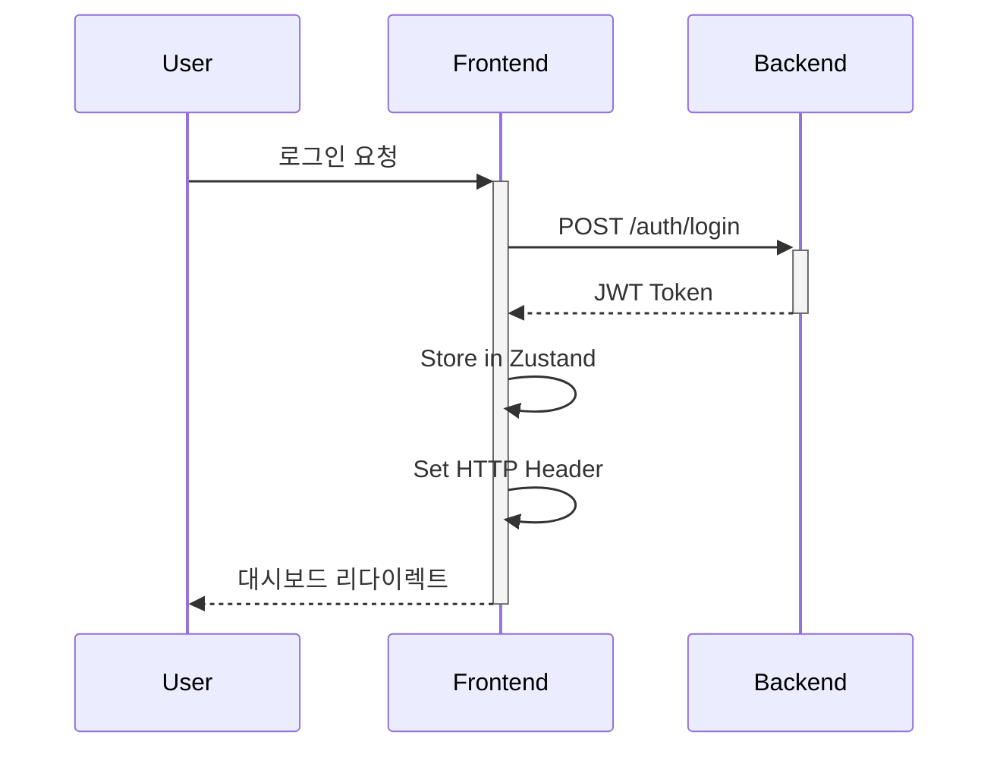

<div align="center">

# Extion AI - Frontend Web


### Modern AI-Powered Excel Automation Platform

*Seamless user experience meets intelligent automation*

[Live Demo](https://extion-beta.vercel.app/) • [Backend Repo](https://github.com/JJJiL0ng/EXTION-server)

---

**SSG/SSR Optimized** • **Responsive Design** • **Agent-Centric UX**

</div>

---

## Overview

**Extion AI Frontend**는 AI 기반 엑셀 자동화 서비스의 사용자 인터페이스를 담당하는 Next.js 애플리케이션입니다. SSG/SSR을 적극 활용한 성능 최적화와 Agent-First UX 설계로 직관적이고 빠른 사용자 경험을 제공합니다.

### Key Features

- **Performance Optimized Landing**: SSG 기반 초고속 랜딩 페이지
- **Secure Authentication**: JWT 기반 인증 시스템
- **Interactive Dashboard**: 실시간 작업 현황 모니터링
- **Drag & Drop Upload**: 직관적인 파일 업로드 인터페이스
- **Agent-Centric UX**: AI 에이전트 작업 흐름에 최적화된 인터랙션
- **Real-time Updates**: TanStack Query를 활용한 실시간 데이터 동기화
- **Fully Responsive**: 모든 디바이스에서 완벽한 경험

---

## Architecture

```
┌──────────────────────────────────────────┐
│         Next.js App Router               │
│  (SSG/SSR/ISR Hybrid Rendering)          │
└────────────┬─────────────────────────────┘
             │
    ┌────────┴────────┐
    │                 │
┌───▼────┐     ┌─────▼──────┐
│  SSG   │     │  SSR/ISR   │
│Landing │     │Auth/Dashboard│
└───┬────┘     └─────┬──────┘
    │                │
    └────────┬───────┘
             │
    ┌────────▼────────┐
    │  Client State   │
    │  (Zustand)      │
    └────────┬────────┘
             │
    ┌────────▼────────┐
    │  Server State   │
    │ (TanStack Query)│
    └────────┬────────┘
             │
    ┌────────▼────────┐
    │   Backend API   │
    │  (NestJS)       │
    └─────────────────┘
```

---

## Tech Stack

### Core Framework
- **Next.js 14**: App Router with SSG/SSR/ISR
- **React 18**: Latest React features
- **TypeScript**: Type-safe development

### Styling & UI
- **Tailwind CSS**: Utility-first CSS framework
- **CSS Modules**: Component-scoped styling
- **Responsive Design**: Mobile-first approach

### State Management
- **TanStack Query (React Query)**: Server state management
  - Caching & synchronization
  - Optimistic updates
  - Infinite queries
- **Zustand**: Lightweight global state management
  - User authentication state
  - UI state (modals, notifications)
  - File upload progress

### Performance & Optimization
- **Next.js Image**: Automatic image optimization
- **Code Splitting**: Route-based lazy loading
- **Bundle Analyzer**: Build size optimization
- **Web Vitals**: Performance monitoring

### Development Tools
- **ESLint**: Code quality
- **Prettier**: Code formatting
- **TypeScript**: Static type checking

---

## Project Structure

```
EXTION-web/
├── src/
│   ├── app/                    # Next.js App Router
│   │   ├── (landing)/         # 랜딩 페이지 (SSG)
│   │   ├── (auth)/            # 인증 페이지 (SSR)
│   │   │   ├── login/
│   │   │   └── signup/
│   │   ├── dashboard/         # 대시보드 (SSR)
│   │   ├── excel/             # 엑셀 처리 페이지
│   │   │   ├── upload/
│   │   │   └── process/
│   │   └── layout.tsx         # Root layout
│   ├── components/
│   │   ├── common/            # 공통 컴포넌트
│   │   ├── excel/             # 엑셀 관련 컴포넌트
│   │   ├── dashboard/         # 대시보드 컴포넌트
│   │   └── ui/                # UI 기본 컴포넌트
│   ├── hooks/                 # Custom React Hooks
│   │   ├── useAuth.ts
│   │   ├── useExcelUpload.ts
│   │   └── useAIAgent.ts
│   ├── lib/
│   │   ├── api/               # API client
│   │   ├── utils/             # Utility functions
│   │   └── constants/         # 상수 정의
│   ├── store/                 # Zustand stores
│   │   ├── authStore.ts
│   │   └── uiStore.ts
│   ├── styles/                # Global styles
│   └── types/                 # TypeScript types
├── public/                    # Static assets
│   ├── images/
│   └── icons/
└── scripts/                   # Build & deploy scripts
```

---

## Getting Started

### Prerequisites

```bash
node >= 18.0.0
npm >= 9.0.0
```

### Installation

```bash
# Clone the repository
git clone https://github.com/JJJiL0ng/EXTION-web.git
cd EXTION-web

# Install dependencies
npm install

# Set up environment variables
cp .env.example .env.local
# Edit .env.local with your configuration
```

### Environment Variables

```env
# API Configuration
NEXT_PUBLIC_API_URL=http://localhost:3000/api
NEXT_PUBLIC_API_TIMEOUT=30000

# Authentication
NEXT_PUBLIC_JWT_SECRET=your-jwt-secret

# Feature Flags
NEXT_PUBLIC_ENABLE_ANALYTICS=true
NEXT_PUBLIC_ENABLE_ERROR_REPORTING=false

# Vercel (Production)
NEXT_PUBLIC_VERCEL_URL=https://extion-beta.vercel.app
```

### Development

```bash
# Development server with hot-reload
npm run dev

# Open http://localhost:3000
```

### Build & Deploy

```bash
# Production build
npm run build

# Start production server
npm run start

# Analyze bundle size
npm run analyze

# Deploy to Vercel (automatic via Git push)
git push origin main
```

### Code Quality

```bash
# Lint code
npm run lint

# Format code
npm run format

# Type check
npm run type-check
```

---

## Key Features Implementation

### 1. **SSG/SSR Hybrid Rendering**

```typescript
// Landing Page (SSG)
export default async function LandingPage() {
  return <LandingContent />;
}

export async function generateStaticParams() {
  // Static generation at build time
}

// Dashboard (SSR)
export default async function Dashboard() {
  const data = await fetchDashboardData();
  return <DashboardContent data={data} />;
}
```

### 2. **Agent-Centric UX**

AI 에이전트의 작업 흐름에 최적화된 인터페이스:
- 단계별 프로그레스 표시
- 실시간 작업 상태 업데이트
- AI 처리 결과 시각화
- 직관적인 에러 핸들링

### 3. **State Management Pattern**

```typescript
// Server State (TanStack Query)
const { data, isLoading } = useQuery({
  queryKey: ['excel', fileId],
  queryFn: () => fetchExcelData(fileId),
  staleTime: 5000,
});

// Client State (Zustand)
const useAuthStore = create((set) => ({
  user: null,
  login: (user) => set({ user }),
  logout: () => set({ user: null }),
}));
```

### 4. **Optimized File Upload**

```typescript
// Chunked upload with progress tracking
const useFileUpload = () => {
  const [progress, setProgress] = useState(0);
  
  const upload = async (file: File) => {
    const chunks = createChunks(file);
    for (const chunk of chunks) {
      await uploadChunk(chunk);
      setProgress((prev) => prev + (100 / chunks.length));
    }
  };
  
  return { upload, progress };
};
```

---

## Performance Optimization

### Landing Page Metrics
- **First Contentful Paint**: < 1.0s
- **Largest Contentful Paint**: < 2.0s
- **Time to Interactive**: < 2.5s
- **Cumulative Layout Shift**: < 0.1

### Optimization Techniques
- SSG for landing page (near-instant load)
- Image optimization with Next.js Image
- Code splitting by route
- Prefetching critical resources
- Lazy loading non-critical components
- Debounced search & input handlers
- React.memo for expensive components
- Virtual scrolling for large lists

---

## Design System

### Color Palette
```css
/* Primary Colors */
--primary: #3B82F6;
--primary-dark: #2563EB;

/* Semantic Colors */
--success: #10B981;
--warning: #F59E0B;
--error: #EF4444;

/* Neutral Colors */
--gray-50: #F9FAFB;
--gray-900: #111827;
```

### Typography
- **Headings**: Pretendard Variable (Korean-optimized)
- **Body**: Inter (Latin), Pretendard (Korean)
- **Code**: JetBrains Mono

### Responsive Breakpoints
```typescript
const breakpoints = {
  sm: '640px',   // Mobile
  md: '768px',   // Tablet
  lg: '1024px',  // Desktop
  xl: '1280px',  // Large Desktop
  '2xl': '1536px' // Extra Large
};
```

---

## Authentication Flow



---

## User Journey

### 1. Landing → Sign Up
```
Landing Page (SSG)
  ↓ (CTA Click)
Sign Up Page (SSR)
  ↓ (Form Submit)
Email Verification
  ↓ (Verify)
Dashboard
```

### 2. Excel Processing Flow
```
Dashboard
  ↓ (Upload Click)
File Upload Modal
  ↓ (Drag & Drop)
Processing Page
  ↓ (AI Agent Work)
Result Preview
  ↓ (Download)
Success ✓
```

---

## Deployment

### Vercel Configuration

```json
{
  "buildCommand": "npm run build",
  "outputDirectory": ".next",
  "devCommand": "npm run dev",
  "installCommand": "npm install",
  "framework": "nextjs",
  "regions": ["icn1"]
}
```

### Automatic Deployment
- **Main Branch**: Production (extion-beta.vercel.app)
- **Feature Branches**: Preview deployments
- **Pull Requests**: Automatic preview links

---

## Analytics & Monitoring

- **Vercel Analytics**: Core Web Vitals tracking
- **Error Tracking**: Sentry integration (if enabled)
- **User Behavior**: Custom event tracking
- **Performance Monitoring**: Real User Monitoring (RUM)

---

## Testing Strategy

```bash
# Unit tests (Future)
npm run test

# E2E tests (Future)
npm run test:e2e

# Component tests (Future)
npm run test:components
```

---

## Key Technical Achievements

### 1. **Ultra-Fast Landing Page**
SSG를 활용한 초고속 랜딩 페이지 구현으로 사용자 첫 인상 최적화
- Build-time 정적 생성으로 서버 부하 제로
- CDN 캐싱으로 글로벌 빠른 로딩
- Critical CSS 인라인화

### 2. **Agent-First UX Design**
AI 에이전트 워크플로우에 최적화된 사용자 경험 설계
- 단계별 명확한 피드백
- 실시간 처리 상태 시각화
- 인터럽트 가능한 작업 흐름

### 3. **Seamless State Management**
TanStack Query + Zustand 조합으로 효율적인 상태 관리
- 서버 상태와 클라이언트 상태 명확한 분리
- Optimistic updates로 즉각적인 UI 반응
- 자동 백그라운드 재검증

### 4. **Production-Grade Performance**
Next.js 14의 최신 기능을 활용한 성능 최적화
- App Router로 향상된 라우팅 성능
- Server Components로 번들 크기 감소
- Streaming SSR로 점진적 페이지 렌더링

### 5. **Developer Experience**
TypeScript와 ESLint를 통한 높은 코드 품질 유지
- 엄격한 타입 체킹으로 런타임 에러 최소화
- 일관된 코드 스타일
- 자동화된 빌드 프로세스

---

## Browser Support

- Chrome (latest)
- Firefox (latest)
- Safari (latest)
- Edge (latest)
- Mobile browsers (iOS Safari, Chrome Mobile)

---

## Contributing

This is a portfolio project and is not actively maintained. However, feedback and suggestions are welcome!

---

## License

This project is licensed under the MIT License.

---

## Developer

**LEE JIHONG**

- GitHub: [@JJJiL0ng](https://github.com/JJJiL0ng)
- Live Demo: [extion-beta.vercel.app](https://extion-beta.vercel.app/)

---

## Project Status

> **Note**: This service was operational from June 2025 to October 2025 and is currently discontinued due to operational reasons. This repository is maintained for portfolio purposes.

---

<div align="center">

**Built with Next.js, TypeScript, and Modern Web Technologies**

If you found this project interesting, please consider giving it a star!

</div>
