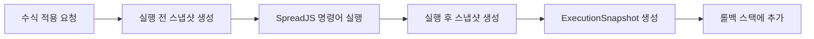
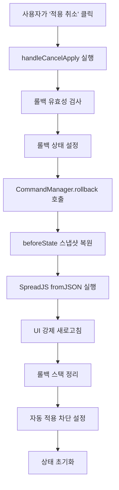

# 수식 롤백 시스템 작동 원리

## 📋 개요

Extion 웹 애플리케이션의 수식 메시지 컴포넌트에서 사용자가 적용한 수식을 이전 상태로 안전하게 되돌리는 롤백 시스템입니다.

## 🏗️ 시스템 아키텍처

### 핵심 컴포넌트

1. **FormulaMessage** (`formulaMessage.tsx`) - UI 레이어
2. **SpreadsheetContext** - Context 관리 레이어
3. **SpreadjsCommandStore** - 상태 관리 및 스냅샷 시스템
4. **SpreadjsCommandEngine** - 명령어 실행 엔진

## 🔄 롤백 플로우

### 1. 수식 적용 시 스냅샷 생성



### 2. 롤백 실행 과정



## 🛡️ 자동 적용 방지 시스템

### 3중 보호 메커니즘

1. **상태 기반 차단**
   - `isRollingBack`: 롤백 진행 중
   - `isRolledBack`: 롤백 완료 직후

2. **시간 기반 차단**
   - `lastRollbackTime.current`: 롤백 시점 기록
   - `isRecentlyRolledBack`: 5초간 차단

3. **useEffect 조건 검사**
   ```typescript
   if (
     mode === 'agent' && 
     !isApplied && 
     !isRollingBack &&     // 상태 기반 차단 1
     !isRolledBack &&      // 상태 기반 차단 2
     !isRecentlyRolledBack && // 시간 기반 차단
     // ... 기타 조건들
   ) {
     // 자동 적용 실행
   }
   ```

## 💾 스냅샷 시스템

### ExecutionSnapshot 구조

```typescript
interface ExecutionSnapshot {
  id: string;                    // 고유 식별자
  timestamp: string;             // 실행 시간
  command: string;               // 실행된 명령어
  commandType: string;           // 명령어 타입
  beforeState: SpreadsheetSnapshot; // 실행 전 상태
  afterState: SpreadsheetSnapshot;  // 실행 후 상태
  description: string;           // 작업 설명
  targetRange: string;           // 영향받은 셀 범위
  success: boolean;              // 성공 여부
  error?: string;                // 에러 메시지 (실패 시)
}
```

### SpreadsheetSnapshot 구조

```typescript
interface SpreadsheetSnapshot {
  id: string;           // 스냅샷 ID
  timestamp: string;    // 생성 시간
  sheetData: any;       // SpreadJS JSON 데이터
  affectedRange: string; // 영향받은 범위
  checksum: string;     // 데이터 무결성 검증
  description: string;  // 스냅샷 설명
}
```

## 🔧 핵심 기능들

### 1. 스냅샷 생성 (`createSnapshot`)

```typescript
const createSnapshot = async (description?: string): Promise<SpreadsheetSnapshot> => {
  // 1. SpreadJS에서 현재 데이터 추출
  const sheetData = spreadRef.current.toJSON({
    includeBindingSource: true,
    ignoreFormula: false,
    ignoreStyle: false,
    saveAsView: true
  });

  // 2. 무결성 검증을 위한 체크섬 생성
  const checksum = generateChecksum(sheetData);

  // 3. 스냅샷 객체 생성 및 저장
  const snapshot = {
    id: uuidv4(),
    timestamp: new Date().toISOString(),
    sheetData,
    checksum,
    description
  };

  return snapshot;
};
```

### 2. 스냅샷 복원 (`restoreSnapshot`)

```typescript
const restoreSnapshot = async (snapshot: SpreadsheetSnapshot): Promise<void> => {
  // 1. 데이터 무결성 검증
  const currentChecksum = generateChecksum(snapshot.sheetData);
  if (currentChecksum !== snapshot.checksum) {
    throw new Error('스냅샷 데이터가 손상되었습니다.');
  }

  // 2. 객체를 extensible하게 만들기 (깊은 복사)
  const clonedData = JSON.parse(JSON.stringify(snapshot.sheetData));

  // 3. SpreadJS에 데이터 복원
  try {
    spreadRef.current.fromJSON(clonedData);
    await new Promise(resolve => setTimeout(resolve, 500)); // 처리 대기
    spreadRef.current.refresh(); // 화면 강제 새로고침
  } catch (error) {
    // 콜백 방식으로 재시도
    await callbackBasedRestore(clonedData);
  }
};
```

### 3. 롤백 실행 (`rollback`)

```typescript
const rollback = async (options: RollbackOptions = { type: 'single' }): Promise<void> => {
  // 1. 롤백 가능 여부 확인
  if (!canPerformRollback()) {
    throw new Error('롤백을 수행할 수 없습니다.');
  }

  // 2. 대상 스냅샷 찾기
  const targetSnapshot = rollbackStack[0]; // single 타입의 경우

  // 3. 사용자 확인 (옵션)
  if (settings.confirmBeforeRollback) {
    const confirmed = window.confirm(`롤백하시겠습니까?\n${targetSnapshot.description}`);
    if (!confirmed) return;
  }

  // 4. beforeState로 복원
  await restoreSnapshot(targetSnapshot.beforeState);

  // 5. 롤백 스택에서 제거
  removeFromRollbackStack(1);

  // 6. 성공 콜백 호출
  onRollbackSuccess?.(targetSnapshot);
};
```

## 🚦 상태 관리

### 롤백 관련 상태들

```typescript
// FormulaMessage 컴포넌트 내부 상태
const [isApplied, setIsApplied] = useState(false);       // 수식 적용 여부
const [isRollingBack, setIsRollingBack] = useState(false); // 롤백 진행 중
const [isRolledBack, setIsRolledBack] = useState(false);   // 롤백 완료 상태
const lastRollbackTime = useRef<number>(0);               // 마지막 롤백 시간

// SpreadjsCommandStore 내부 상태
const rollbackStack: ExecutionSnapshot[];                 // 롤백 가능한 작업들
const canRollback: boolean;                               // 롤백 가능 여부
const currentSnapshot: SpreadsheetSnapshot | null;        // 현재 스냅샷
```

## 🔒 안전 장치들

### 1. 데이터 무결성 보장
- **체크섬 검증**: SHA-256 해시로 데이터 손상 검출
- **깊은 복사**: JSON 직렬화로 객체 extensible 보장
- **타입 안전성**: TypeScript 인터페이스로 타입 검증

### 2. 에러 처리
- **단계별 로깅**: 각 단계마다 상세한 로그 출력
- **타임아웃 처리**: 5초 타임아웃으로 무한 대기 방지
- **폴백 메커니즘**: 동기 방식 실패 시 콜백 방식으로 재시도

### 3. 메모리 관리
- **제한된 히스토리**: 과도한 메모리 사용 방지
- **자동 정리**: 불필요한 스냅샷 자동 제거
- **약한 참조**: 메모리 누수 방지

## 🐛 트러블슈팅

### 일반적인 문제들

1. **"Cannot add property isApplyRefilter, object is not extensible"**
   - **원인**: SpreadJS가 frozen 객체에 속성 추가 시도
   - **해결**: JSON.parse(JSON.stringify())로 깊은 복사

2. **"Cannot delete property '0' of [object Array]"**
   - **원인**: Zustand에서 immutable 배열 직접 수정
   - **해결**: set() 함수 내부에서 splice 실행

3. **롤백 후 자동 재적용**
   - **원인**: useEffect 의존성 배열 트리거
   - **해결**: 시간 기반 차단 시스템 구현

### 디버깅 도구

```typescript
// 자동 적용 조건 로깅
console.log('🔍 자동 적용 조건 체크:');
console.log('  timeSinceRollback:', timeSinceRollback);
console.log('  isRecentlyRolledBack:', isRecentlyRolledBack);

// 롤백 과정 추적
console.log('🔧 rollback 함수 시작');
console.log('🔄 스냅샷 복원 시작');
console.log('✅ 롤백 함수 완료');
```

## 📈 성능 최적화

### 1. 비동기 처리
- Promise.race로 타임아웃 구현
- 병렬 처리 가능한 작업들 동시 실행

### 2. 메모리 효율성
- 필요한 경우에만 스냅샷 생성
- 자동저장 생략으로 불필요한 스냅샷 방지

### 3. UI 응답성
- 로딩 상태 표시
- 사용자 피드백 즉시 제공

## 🔮 향후 개선 방안

1. **선택적 롤백**: 특정 셀 범위만 롤백
2. **다중 롤백**: 여러 단계 한 번에 롤백
3. **롤백 미리보기**: 롤백 결과 사전 확인
4. **자동 백업**: 주기적 자동 스냅샷 생성
5. **클라우드 동기화**: 롤백 히스토리 클라우드 저장

---

*이 문서는 Extion 수식 롤백 시스템의 기술적 구현을 설명합니다. 추가 문의사항이 있으시면 개발팀에 연락해주세요.*